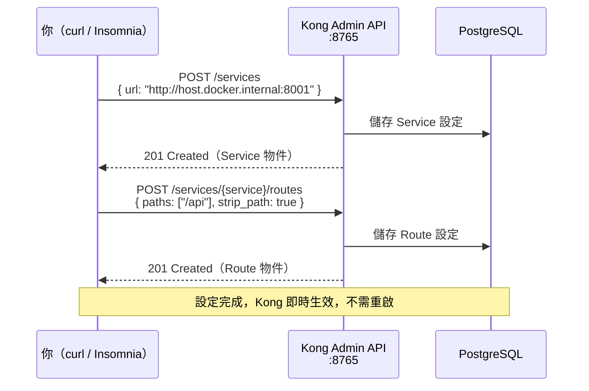
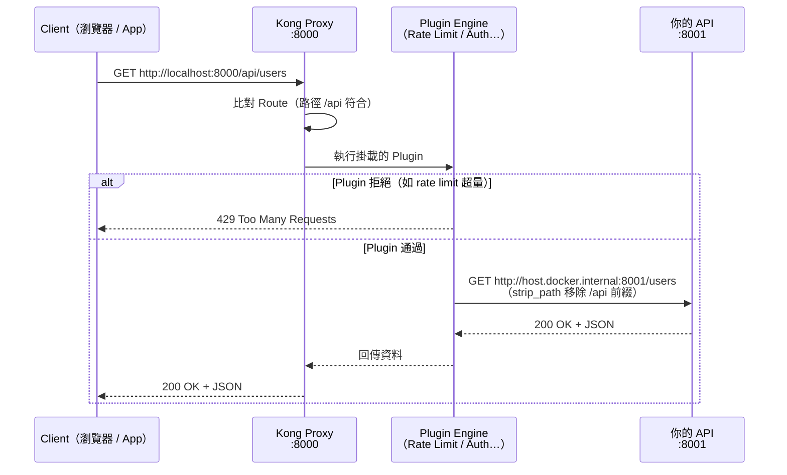

# Kong API Gateway

本專案使用 **Kong 3.7.0** 作為 API Gateway，透過 Docker Compose 運行。

---

## 目錄

- [Port 對應表](#port-對應表)
- [架構概覽](#架構概覽)
- [Workflow：設定流程](#workflow設定流程)
- [Workflow：Request 代理流程](#workflowrequest-代理流程)
- [快速開始](#快速開始)
- [實例：代理 port 8001 的 API](#實例代理-port-8001-的-api)
- [新增 Plugin（可選）](#新增-plugin可選)
- [管理介面](#管理介面)
- [知識庫文件](#知識庫文件)

---

## Port 對應表

| Port | 用途 | 說明 |
|------|------|------|
| `8000` | **Kong Proxy（HTTP）** | Client 打 API 的入口 |
| `8443` | Kong Proxy（HTTPS） | HTTPS 入口 |
| `8765` | **Kong Admin API** | 用來設定 Service / Route / Plugin |
| `8002` | Kong Manager（GUI） | 瀏覽器視覺化管理介面 |
| `5433` | PostgreSQL | Kong 設定資料庫（host 5432 已佔用故用 5433） |

---

## 架構概覽

```
┌─────────────────────────────────────────────┐
│                  你的機器 (Host)              │
│                                             │
│   Client                                   │
│     │                                      │
│     ▼                                      │
│  :8000 ──► Kong Container ──► :8001 API    │
│              │                             │
│           :8765 (Admin API)                │
│           :8002 (GUI)                      │
│              │                             │
│           PostgreSQL (:5433)               │
└─────────────────────────────────────────────┘
```

Kong 在 Docker 內部要連到 Host 上的 API，必須使用 `host.docker.internal` 而非 `localhost`。

---

## Workflow：設定流程

第一次使用 Kong 需要透過 **Admin API（port 8765）** 登記你的後端服務。



---

## Workflow：Request 代理流程

設定完成後，Client 的每一個請求都會這樣走：



> **strip_path**：Route 設定 `strip_path=true` 時，`/api/users` 到後端會變成 `/users`。
> 設 `strip_path=false` 則後端收到完整路徑 `/api/users`。

---

## 快速開始

### 1. 啟動 Kong

```bash
cd /home/yisheng/kong
docker compose up -d

# 等待約 20 秒，確認啟動正常
curl http://localhost:8765/ | python3 -m json.tool | grep version
```

### 2. 登記你的 API 為 Service

```bash
curl -X POST http://localhost:8765/services \
  -d name=my-api \
  -d url=http://host.docker.internal:8001
```

### 3. 建立 Route

```bash
curl -X POST http://localhost:8765/services/my-api/routes \
  -d name=my-api-route \
  -d "paths[]=/api" \
  -d strip_path=true
```

### 4. 測試

```bash
# 原本直接打後端
curl http://localhost:8001/users

# 現在透過 Kong
curl http://localhost:8000/api/users
```

兩者回應應該一致，代表 Kong 正常代理。

---

## 實例：代理 port 8001 的 API

假設你有一個 FastAPI / Express 應用跑在 `localhost:8001`，路由如下：

| 原始路由 | 透過 Kong 存取 |
|---------|--------------|
| `GET  :8001/users` | `GET  :8000/api/users` |
| `POST :8001/login` | `POST :8000/api/login` |
| `GET  :8001/docs`  | `GET  :8000/api/docs`  |

### 完整設定指令

```bash
# Step 1：建立 Service（指向 host 上的 :8001）
curl -X POST http://localhost:8765/services \
  -d name=my-api \
  -d url=http://host.docker.internal:8001 \
  -d connect_timeout=60000 \
  -d read_timeout=60000

# Step 2：建立 Route
curl -X POST http://localhost:8765/services/my-api/routes \
  -d name=my-api-route \
  -d "paths[]=/api" \
  -d strip_path=true \
  -d "methods[]=GET" \
  -d "methods[]=POST" \
  -d "methods[]=PUT" \
  -d "methods[]=DELETE" \
  -d "methods[]=OPTIONS"

# Step 3：確認設定
curl http://localhost:8765/services/my-api
curl http://localhost:8765/services/my-api/routes
```

### 驗證

```bash
# Kong 狀態
curl -I http://localhost:8000/api/

# 查看所有 Services
curl http://localhost:8765/services | python3 -m json.tool

# 查看所有 Routes
curl http://localhost:8765/routes | python3 -m json.tool
```

---

## 新增 Plugin（可選）

Plugin 掛在 Service 或 Route 上，所有經過該 Service/Route 的請求都會套用。

### Rate Limiting（限流）

```bash
curl -X POST http://localhost:8765/services/my-api/plugins \
  -d name=rate-limiting \
  -d config.minute=100 \
  -d config.policy=local
```

### CORS

```bash
curl -X POST http://localhost:8765/services/my-api/plugins \
  -d name=cors \
  -d "config.origins[]=*" \
  -d "config.methods[]=GET" \
  -d "config.methods[]=POST" \
  -d "config.methods[]=OPTIONS" \
  -d "config.headers[]=Authorization" \
  -d "config.headers[]=Content-Type"
```

### Key Authentication（API Key）

```bash
# 1. 掛 Plugin
curl -X POST http://localhost:8765/services/my-api/plugins \
  -d name=key-auth

# 2. 建立 Consumer
curl -X POST http://localhost:8765/consumers \
  -d username=alice

# 3. 給 Consumer 一把 Key
curl -X POST http://localhost:8765/consumers/alice/key-auth \
  -d key=alice-secret-key

# 4. 呼叫時帶上 Header
curl http://localhost:8000/api/users \
  -H "apikey: alice-secret-key"
```

---

## 管理介面

| 方式 | 位址 | 說明 |
|------|------|------|
| **Kong Manager（GUI）** | http://localhost:8002 | 視覺化管理，適合瀏覽設定 |
| **Admin API** | http://localhost:8765 | RESTful，適合腳本操作 |
| **Insomnia / Postman** | 打 :8765 | 手動測試設定用 |

---

## 知識庫文件

詳細說明請見 [`notes/`](notes/) 目錄：

| 文件 | 內容 |
|------|------|
| [00-overview.md](notes/00-overview.md) | 專案概覽 |
| [01-core-concepts.md](notes/01-core-concepts.md) | Service / Route / Plugin / Consumer 概念 |
| [02-admin-api.md](notes/02-admin-api.md) | Admin API 完整操作參考 |
| [03-plugins.md](notes/03-plugins.md) | 常用 Plugin 設定說明 |
| [04-setup.md](notes/04-setup.md) | 環境建置與 deck 使用 |
| [05-troubleshooting.md](notes/05-troubleshooting.md) | 常見問題排查 |
